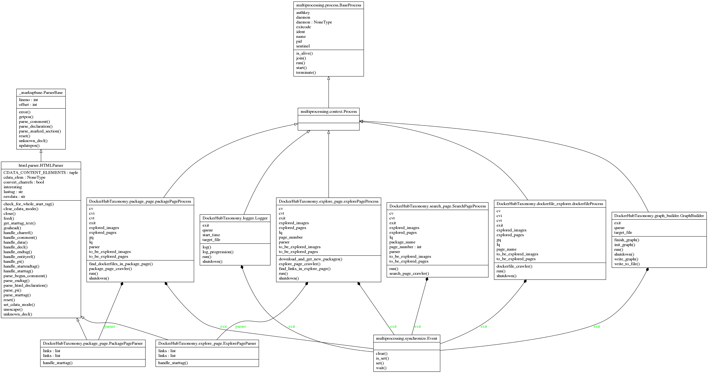
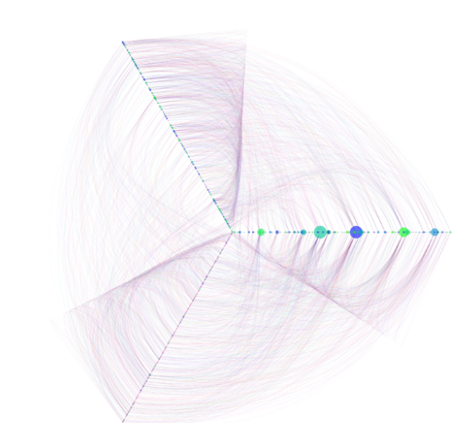
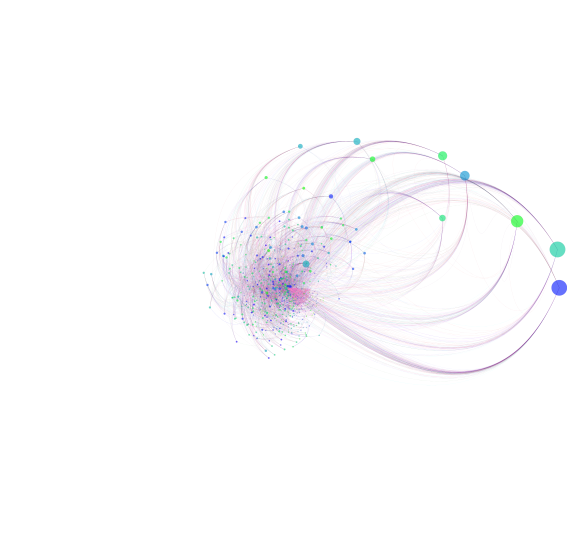
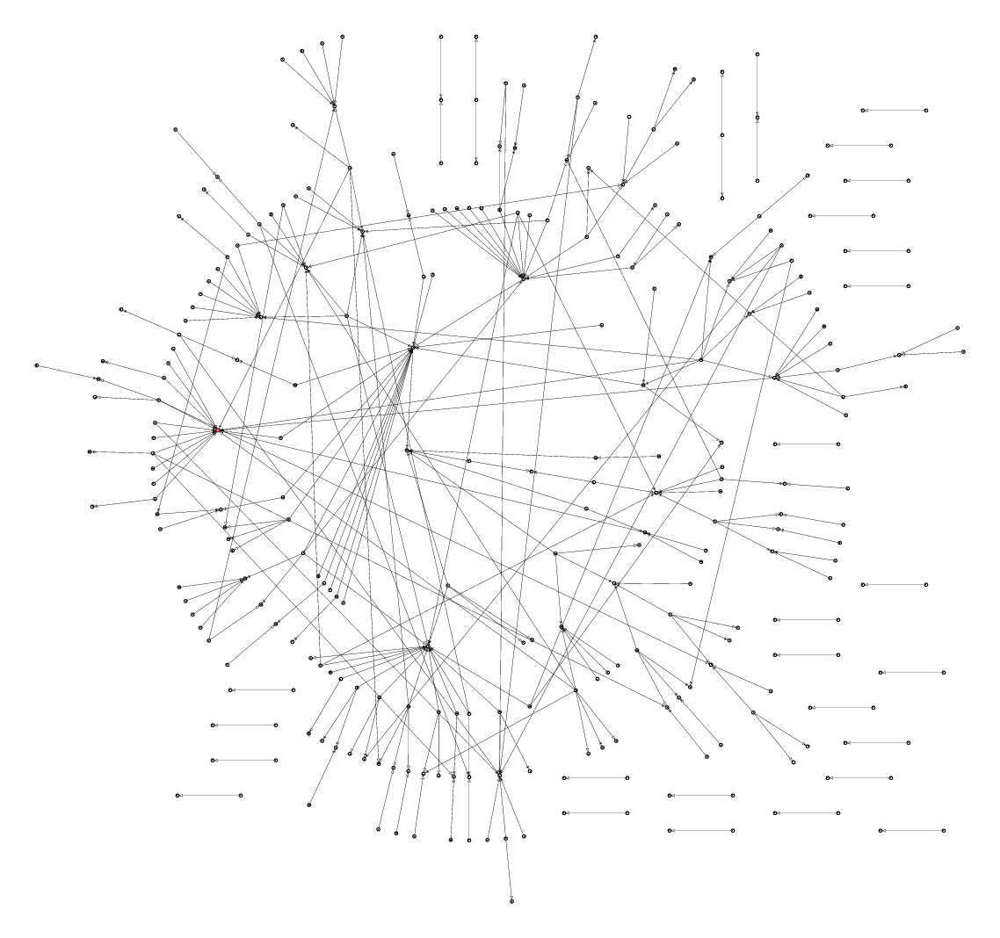

.. role:: raw-latex(raw)
   :format: latex

Lexique
=======

:raw-latex:`\renewcommand\arraystretch{2}`

.. table:: Lexique
   :widths: auto, 60

   ===================  ============
   Mot clé              Définition
   -------------------  ------------
   Python               Le langage de programmation utilisé pour le développement de l'application. Un programme python nécessite d’être exécuté par un interpréteur Python. Un programme Python dépend souvent d’un certain nombre de packages Python.

   Package              Un ensemble de fonctionnalités implémentées et offertes par des membres de la communauté Python, afin d’étendre les possibilités du langage. Un package utilisé par un programme Python doit être installé sur l’ordinateur du client. Docker Hub Taxonomy utilisant de multiples packages, il est nécessaire de les installer avant de pouvoir utiliser l'application.

   Crawler              Un Crawler est un logiciel automatisé qui a pour but d'explorer des pages web et d'en receuillir des informations. De cet anglicisme est tiré le verbe crawler.

   Docker Hub           Docker Hub est la plateforme hébergeant les images Docker. À l'heure actuelle, plus de 100'000 images peuvent être trouvées.

   Docker               Docker est une plateforme permettant d'exécuter du code à l'intérieur d'un conteneur indépendamment de la machine sur laquelle l'exécution a lieu.

   Dockerfile           Un dockerfile est un fichier décrivant la construction d'une image Docker. Il est souvent composé d'une clause FROM qui récupère une couche inférieur, puis éventuellement de diverses commandes ajoutant ou non des fonctionnaliés à la couche inférieur.

   Image Docker         Une image Docker est construite sur une série de couches qui sont également des images.

   Container            Un container est une instance d'une image composée d'une couche supplémentaire accessible en lecture/écriture. De ce fait, plusieurs containers peuvent donc partager la même image tout en ayant leur propre couche unique.

   Conteneur            Un conteneur est semblable a une machine virtuelle à défaut qu'il n'embarque pas un système d'exploitation complet ce qui le rend beaucoup plus léger.

   Round de crawl       Un round consiste dans le cadre de ce projet à la réalisation d'une tâche de crawling. Il peut s'agir de télécharger et analyser une page afin de récupérer les liens ou de télécharger un Dockerfile afin d'en extraire la couche inférieure.
   ===================  ============

:raw-latex:`\bigskip`

Introduction
============
Le déploiement d’applications sur les nuages de calcul a évolué sur un modèle de virtualisation au niveau du système d’exploitation. On parle alors de conteneurs, qui s’exécutent en tant que processus d’utilisateur de façon complètement isolée. Docker est une technologie qui simplifie le déploiement de conteneurs. Ce système propose un dépôt d’images, un système de fichiers et un ensemble de programmes qui automatisent le téléchargement, le lancement et la gestion de conteneurs. Un très grand nombre d’acteurs importants offre la possibilité d’intégrer des conteneurs de ce type dans leurs solutions de cloud. Selon des statistiques récentes, Docker offre presque un million d’images différentes, qui ont été installées sur près de 10 milliards d’ordinateurs.

:raw-latex:`\medskip`
Selon le modèle proposé par Docker, une image peut être basée sur une autre. Par exemple, l’image "tomcat" de Docker (serveur populaire d’applications) dépend de l’image "openjdk" (environnement Java) qui dépend ensuite de l’image "alpine" (version populaire de Linux). L’installation est invisible à l’utilisateur et se fait en couches. Le logiciel de gestion de Docker télécharge et installe d’abord l’image "alpine", puis ensuite l’image "openjdk", puis "tomcat". L’image "alpine" n’est pas réinstallée si un autre conteneur est lancé avec une autre image qui en dépend, comme par exemple le serveur web "nginx". Grâce à son modèle en couches, et au fait qu’un conteneur n’est pas plus qu’un processus d’utilisateur, la surcharge imposée par ce modèle de virtualisation est bien inférieure à celle des machines virtuelles, ce qui l’a rendu très populaire.

.. figure:: img/container-layers.jpg
    :width: 100%
    :height: 100%
    :alt: Illustration container et couches docker

    Illustration container et couches Docker

La figure $\ref{img/container-layers.jpg}$ représente la structure d'un container Docker. Ce container est basé sur Ubuntu 15.04 et est composé de toutes les couches inférieurs de cette image.

Le but de ce projet est de parcourir ces images et de trouver leurs relations et couches.

Fonctionnalités implémentées
============================

En l'état, une fois lancé, le programme est capable de crawler Docker Hub et de recuillir les informations sur les images et leurs couches.

Log
^^^

Pour pouvoir recueillir des informations sur le déroulement du programme, les "rounds" de crawling sont chronométrées et loggées dans un fichier au format TOML [#]_. Cela permet d'afficher un graphe contenant le temps par round de manière chronologique.

.. [#] `Tom's Obvious, Minimal Language: https://github.com/toml-lang/toml <https://github.com/toml-lang/toml>`_

:raw-latex:`\medskip`
Example de log d'un round de crawl:

.. code-block:: Toml

    ["1.4190404415130615"]
        Explored_pages = 0
        To_be_explored_pages = 8
        Explored_images = 0
        Images_to_be_explored = 0
        Duration = 1.3270289897918701

Des exemples de graphes affichant les statistiques peuvent être trouvées au chapitre `Résultats`_

Relations entre les images
^^^^^^^^^^^^^^^^^^^^^^^^^^

Afin d'afficher les relations entre les images, les informations recuillies sont stockées dans un fichier au format dot. Ce format permet de décrire un graphe au format texte. Dans le cas de ce travail, le graph résultant est dirigé. C'est à dire qu'il indique dans quel sens vont les relations entre les images.

Example:

.. code-block:: Dot

    digraph {
    a -> b;
    b -> c;
    c -> d;
    d -> a;
    }

:raw-latex:`\medskip`

De plus, il est possible d'afficher des informations générales. Pour ce faire, un script permet d'afficher un graphe contenant le nombre de relations par image.

Représentation graphique des relations
^^^^^^^^^^^^^^^^^^^^^^^^^^^^^^^^^^^^^^

Afin d'afficher la structure des relations entre les images de manière graphique, un code de génération de fichier svg [#]_ à partir des logs du crawl a été réalisé. Afin de pouvoir afficher ces relations de manière graphique, il est nécessaire de transformer le graph du point précédant en un graph non dirigé. C'est à dire que les relations entre les images n'ont plus de sens.

.. [#] `Scalable Vector Graphics, voir bibliographie.`

Il est possible de trouver les figures représentant ces relations au chapitre `Résultats`_.

:raw-latex:`\medskip`

Un script bash permet la réalisation de toutes les opérations suivant le crawl.

Architecture
============

Ce chapitre décrit l'architecture du projet. En premier lieu, une brève explication sur les fichiers est donnée puis le diagramme de classe UML est représenté

Arborescence du projet
^^^^^^^^^^^^^^^^^^^^^^

|    DockerHubTaxonomy
|    |   .gitignore
|    |   qa.sh
|    |   README.md
|    |
|    +---Doc
|    |   +---Cahier des charges
|    |   +---Journal de travail
|    |   \\---Rapport
|    |
|    \\---DockerHubTaxonomy
|        |   dockerfile_explorer.py
|        |   dot2pdf.sh
|        |   explore_page.py
|        |   graph_builder.py
|        |   logger.py
|        |   package_page.py
|        |   search_page.py
|        |   tools.py
|        |   __init__.py
|        |   __main__.py
|        |
|        +---generated
|        \\---test

Comme on peut le voir ci-dessus, le dossier de projet `DockerHubTaxonomy` est sous la forme d'un projet github. Il est possible d'y trouver un fichier `.gitignore`, un script de test concernant l'assurance qualité du code, un fichier `README` expliquant brièvement le projet et deux dossiers. Ce sont ces derniers qui sont expliqués.

:raw-latex:`\medskip`
Le premier dossier, `Doc`, contient le cahier des charges, le rapport et le journal de travail. Ces 3 fichiers étant réalisé en RestTructuredText, ils sont ensuite convertis en pdf. Ceci libère d'une tâche de mise en page étant donné qu'elle est générée automatiquement.

:raw-latex:`\medskip`
Le deuxième dossier, appelé lui aussi `DockerHubTaxonomy`, contient lui les codes sources permettant de réaliser un crawl.

    Le fichier `__main__.py` est le point d'entrée du projet. C'est ce package qui lance le crawl et instancie les différents process qui seront utilisés pour crawler.

    Le fichier `__init__.py` est un fichier utilisé pour que python traite le dossier comme un package afin de repérer les sous packages.

    Le fichier `dot2pdf.sh` sert à générer les graph à partir des fichiers de logs.

    Le fichier `tools.py` contient des fonctions utilitaires pour les autres packages.

    Le fichier `explore_page.py` contient la classe `explorePageProcess` expliquée dans la section suivante.

    Le fichier `package_page.py` contient la classe `packagePageProcess` expliquée dans la section suivante.

    Le fichier `search_page.py` contient la classe `SearchPageProcess` expliquée dans la section suivante.

    Le fichier `dockerfile_explorer.py` contient la classe `dockerfileProcess` expliquée dans la section suivante.

    Le fichier `graph_builder.py` contient la classe `GraphBuilder` expliquée dans la section suivante.

    Le fichier `logger.py` contient la classe `Logger` expliquée dans la section suivante.

    Le dossier `generated` contient les résultats des crawls écrits automatiquement et des utilitaires permettant de créer les pdf et graphes.

    Le dossier `test` contient des essais de scripts et de résultats divers et variés.

Diagramme UML
^^^^^^^^^^^^^

    Diagramme uml

La figure $\ref{img/classes_DockerHubTaxonomy.png}$ représente le diagramme UML du projet. Il est expliqué ci-après.

Description des classes
^^^^^^^^^^^^^^^^^^^^^^^

Toutes les classes dérivent de `multiprocessing.Process` afin de pouvoir travailler simultanément. De plus amples explications peuvent être trouvées dans la section suivante.

`explorePageProcess`
####################

Cette classe permet d'explorer une page de la section "Explore" de Docker Hub. À partir de cette page, les processus lancés récupèrent les liens vers les pages descriptives des images et les retournent.

Cette classe utilise également un parser contenu dans le même fichier qui est utilisé pour extraire les liens du code html téléchargé.

`packagePageProcess`
####################

Cette classe permet d'explorer les pages situées à l'adresse récupérée par la classe ci-dessus. À partir de ces pages, le process est capable de repérer les liens vers le(s) Dockerfile(s) référencés dans la page. De plus, après en avoir trouvé, il lance un process `dockerfileProcess` capable d'extraire la couche inférieure de l'image dans le fichier. Ceci pour chaque Dockerfile trouvé.

Ce n'est pas la seule tâche exécutée par cette classe. Elle instancie également des process `SearchPageProcess` qui sont détaillés ci-après.

Cette classe utilise également un parser contenu dans le même fichier qui est utilisé pour extraire les liens du code html téléchargé.

`SearchPageProcess`
###################

Cette classe permet de lancer une recherche sur Docker Hub et d'explorer plus ou moins de pages de cette recherche. Elle fonctionne de la même manière qu'`explorePageProcess` et en dérive.

`dockerfileProcess`
###################

Cette classe permet d'analyser un Dockerfile afin d'en tirer la couche inférieure représentée par la clause `From`. Une fois qu'une sous-couche est trouvée, le process met le lien dans une queue afin que ce lien soit écrit dans le fichier de description du graph.

Exemple:

.. code-block:: Dockerfile

    FROM scratch
    ADD rootfs.tar.xz /
    CMD ["/bin/sh"]

`GraphBuilder`
##############

Cette classe sert à écrire dans le fichier représentant la structure du graph. Elle crée le fichier dans le dossier correspond et attend que des relations soient placés dans la queue pour les écrire.

`Logger`
########

Cette classe sert à loguer la durée des rounds de crawl. Chaque process écrit dans une queue la durée du round (le round correspond à l'exécution de la fonctionnalité) et ce process les récupère et les écrit dans le fichier de log. Ceci permet d'afficher des statistiques sur le Crawl en général.

Multiprocessing
^^^^^^^^^^^^^^^

Le package Multiprocessing permet d'exécuter des tâches de manière concurrente. Chaque classe ci-dessus est lancée comme un ou plusieurs process et permet donc d'exécuter des tâches en parallèle. De ce fait, les process ne peuvent pas communiquer de manière normale entre eux avec listes, il doivent utiliser des queues qui empêchent les conflits d'écriture ou de lecture.

Méthodologie
============

Le projet s'est principalement déroulé selon une méthodologie de recherches puis d'implémentation. Il a fallu se renseigner sur beaucoup d'aspect tel que la meilleure technologie à utiliser, les limitations et possibilités de Docker Hub, comment visualiser les dépendances, etc. Le cahier des charges en annexe liste tous les points de recherche.
Plus de la moitié du temps consacré au projet s'est déroulé dans le cadre de recherches.
De ce fait, aucun planning n'a été défini à l'avance car il était impossible d'évaluer le temps nécessaire pour effectuer ces recherches. Le projet s'est donc déroulé de manière itérative. C'est à dire que chaque fois qu'une fonctionnalité était implémentée, elle était testée à la main puis une nouvelle recherche et une nouvelle implémentation suivait.

Au fur et à mesures il a été possible de développer des solutions suivant les objectifs du cahier des charges. Tout d'abord, un simple script permettait la recherche de lien sur les pages explore, ensuite les pages des packages ont pu être analysées puis les dockerfiles. Suite à cela, le multiprocessing a été implémenté afin de gagner en performances et de ce fait, la communication entre les process a du être implémentée de manière concurrente. Ne connaissant pas le multiprocessing en python, il a fallu à nouveau effectuer des recherches.

:raw-latex:`\medskip`
Une fois que le crawl pouvait être lancé, il a fallu trouver un moyen d'enregistrer les relations entre les différentes images puis l'implémenter. Le choix s'est porté sur le format Dot de Graphviz qui offre des avantages de par sa simplicité mais a néanmoins généré des inconvénients qui peuvent être trouvés dans la section suivante.

:raw-latex:`\medskip`
Durant tout le processus de développement, des tests d'assurance qualité concernant la qualité du code ont été réalisés afin de garder le code lisible et compréhensible pour un autre développeur.

:raw-latex:`\medskip`
Grâce à un journal de travail à jour et aux messages des commits, la continuité du travail et les décisions prises ont pu être suivies.

Difficultés rencontrés
======================

Plusieurs difficultés ont été rencontrées durant la réalisation de ce projet. En effet, n'ayant pas un cahier des charges basé sur des actions à effectuer mais sur des recherches à approfondir, il a fallu trouver des technologies compatibles et apprendre des nouvelles pratiques avant de pouvoir développer le projet.

:raw-latex:`\medskip`
Tout d'abord, il a fallu trouver quels utilitaires utiliser pour crawler, rechercher les liens à cibler, et définir une méthode pour extraire ces liens. Cette partie fastidieuse du travail a apporté de multiples réflexions et difficultés car les pistes étudiées et les chemins empruntés n'étaient pas toujours les bons et il a fallu recommencer à de multiples reprises.

Suite à cela, pour pouvoir améliorer les performances, il a été nécessaire d'implémenter du parallélisme. La communication inter-process n'étant pas toujours facile à cerner et réaliser de manière correcte, un certain temps à été utilisé à ces fins.

:raw-latex:`\medskip`
Ne disposant pas de serveur ou cluster de calcul à disposition, il a fallu réaliser les crawls sur la machine de travail. De ce fait, lors des crawls, il était impossible d'effectuer un quelconque autre travail sur cette machine car l'utilisation des resources était trop élevée. Dès lors, il n'était pas possible de crawler souvent ni de crawler pendant un laps de temps supérieur à 48h.

:raw-latex:`\medskip`
Après avoir obtenu des résultats de crawl concluants est venu le temps de trouver une manière d'afficher les relations entre les images. Beaucoup de bibliothèque permettent d'afficher des graphes cependant la quasi-totalité nécessitent de lire plusieurs dizaines de pages de documentation. De plus, très peu d'entre-elles fournissent des services étant capables d'utiliser des fichiers Dot comme format de graphe.

Après avoir recherché des bibliothèques dans diverses technologies, il a été difficile de trouver une solution viable.

Mon choix s'est finalement porté sur une utilisation combinée de `Pyveplot`, `Networkx` et `Matplotlib` [#]_ après de longues recherches.

.. [#] `Des packages pythons permettant la visualisation de graphes.`

Résultats
=========

Relations entre les images
^^^^^^^^^^^^^^^^^^^^^^^^^^

    Graphe de dépendances

    Graphe de dépendances avec positionnement des noeuds altéré

    Graphe de dépendances généré avec "Twopi", compris dans le package graphviz de base.

Grace à l'utilisation des 3 technologies citées dans la section précédente, il a été possible de visualiser les dépendances entre les images. Ces relations sont illustrées dans les figures $\ref{img/hiveplot3axes.png}$ et $\ref{img/hiveplot89axesAlteredPositions.png}$ de la manière suivante.

:raw-latex:`\medskip`
- Un point représente un noeud donc une image. Plus le diamètre du point est élevé, plus le noeud a de relations (ici aucune différence n'est faite entre relation sortante et entrante, il ne s'agit plus d'un graph dirigé).
- Un trait représente un lien donc une dépendance vers ou depuis une autre image.

:raw-latex:`\medskip`
La figure $\ref{img/twopiGraphDot.png}$ représente quant à elle un graphe généré avec un outil de base, "Twopi", pouvant être installé via le paquet Graphviz. Il est possible d'observer que les relations sont dirigées, cependant peu de configurations sont possibles et les noeuds sont placés automatiquement.

Statistiques de crawl
^^^^^^^^^^^^^^^^^^^^^

La figure $\ref{img/15hoursCrawlStats.pdf}$ illustre un graphe résultant d'un crawl qui a duré 15h. On peut observer que plus de 35'000 pages et 10'000 images ont été explorées.

:raw-latex:`\medskip`
La figure $\ref{img/sawTeethCrawlStats.pdf}$ illustre un graphe résultant d'un crawl dont le nombre de processus était mal paramétré. On peut observer que trop de processus effectuants des recherches sont lancés, donc le nombre de pages à explorer augmente et de ce fait le temps nécessaire pour effectuer un round de crawl augmente de manière significative.

:raw-latex:`\medskip`
La figure $\ref{img/edgesStats.pdf}$ regroupe elle les noeuds par le nombre de relations, sans distinction de relation sortante ou entrante. Comme on le voir, peu de noeuds ont beaucoup de relations, et à l'inverse, beaucoup de noeunds ont beaucoup de relations.

.. figure:: img/15hoursCrawlStats.pdf
    :width: 100%
    :height: 100%
    :alt: graphe résultant d'un crawl qui a duré 15h

    Graphe résultant d'un crawl qui a duré 15h

.. figure:: img/sawTeethCrawlStats.pdf
    :width: 100%
    :height: 100%
    :alt: graphe résultant d'un crawl mal paramétré

    Graphe résultant d'un crawl mal paramétré

.. figure:: img/edgesStats.pdf
    :width: 100%
    :height: 100%
    :alt: graphe regroupant les noeuds par leur nombre de relations

    Graphe regroupant les noeuds par leur nombre de relations

Evolutions possibles
====================

À l'heure actuelle, il n'est pas possible de stocker plus d'informations sur les images que leurs simple relations. Par simple relation il est entendu seulement la dernière version d'une image. Les images disposant de plusieurs versions sont toutes traitées comme s'il ne s'agissait que d'une seule image. Séparer les versions des images serait une première évolution possible.

:raw-latex:`\medskip`
Suite à celà, il serait judicieux de pouvoir counstruire un graph à la volée plutôt que d'écrire les liens dans un fichier Dot. De ce fait, il serait possible de stocker le graph et au besoin de générer des fichiers de sortie dans des formats différents. Ceci permettrait d'utiliser des technologies d'affichage différentes et permettrait également d'afficher sur le graph différentes caractéristiques de chaque noeud.

:raw-latex:`\medskip`
Suite à cela, implémenter une technologie de visualisation dynamique qui permettrait à l'utilisateur d'intéragir avec le graph en déplaçant des noeuds pourrait être une évolution envisageable.

:raw-latex:`\medskip`
La dernière évolution, qui n'est pas des moindres, serait d'implémenter un crawl distribué sur plusieurs machines. De ce fait, les performances augmenteraient encore et il serait possible de récupérer plus rapidement un nombre d'informations plus important. Cependant, le calcul distribué apporte d'autres problèmatique de persistance des données et de stockage.

Conclusion
==========

Au premier abord, le problème paraît simple à résoudre. Crawler un site web, récupérer des informations sur des images et les stocker. Cependant, plus le projet progresse et plus la difficulté augmente. Après avoir résolu des solutions pour les paliers précédents, il s'est parfois avéré que des problèmes avaient été crées pour lesquels il a fallu également trouver des solutions.

Durant tout le déroulement du projet, des avancées ont été réalisées mais presque toutes ont été ralenties par l'apparition de nouveaux problèmes.

:raw-latex:`\medskip`
À l'heure actuelle, l'application Docker Hub Taxonomy fonctionne et les objectifs principaux du cahier des charges, qui peut être trouvé en annexe, ont été respectés. Un des objectifs secondaires (Choisir une technologie pour améliorer les performances du crawler) l'a également été. Cependant, le produit étant fonctionnel, il n'est pas terminé. Beaucoup d'améliorations, citées dans le chapitre précédant, sont encore possibles.

:raw-latex:`\medskip`
De plus, l'efficacité exacte d'une telle application est difficile à tester. En effet, produire un lot de données de test est très compliqué. Il faudrait mettre en place un serveur de test avec une structure connue de relation entre les images, ce qui est impossible dans le cadre d'un travail d'automne.

Bibliographie
=============

Introduction
^^^^^^^^^^^^

Description de projet de la forge, 22.01.2018:

https://forge.ing.he-arc.ch/projects/he-arc-inf-1718-dlm-ta-212

About images,containers, and storage drivers, 24.01.2018:

https://docs.docker.com/engine/userguide/storagedriver/imagesandcontainers/#container-and-layers

Lexique
^^^^^^^

Crawler par E-Marketing, 22.01.2018 :

http://www.e-marketing.fr/Definitions-Glossaire/Crawler-254965.htm#ubw9ULdP5HTOcZ5h.97

Introduction à Docker par "Putain de code!", 22.01.2018 :

http://putaindecode.io/fr/articles/docker/

Fonctionnalités implémentées
^^^^^^^^^^^^^^^^^^^^^^^^^^^^

Scalable Vector Graphics de Wikipédia, 24.01.2018:

https://fr.wikipedia.org/wiki/Scalable_Vector_Graphics

Annexe
======

Cahier des charges
^^^^^^^^^^^^^^^^^^

:raw-latex:`\includepdf[pages=-]{../CahierDesCharges/CahierDesCharges.pdf}`
